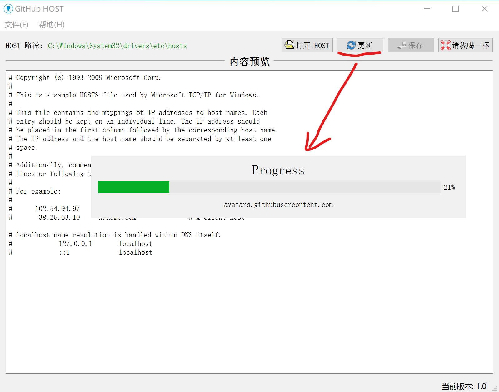

# GitHubHOST

A small tool for update github hosts

## For windows

Take care! The application build on Windows 10 with python 3.8, not tested all windows platforms.

- Step 1: Open the application: `GitHubHOST-1.0.exe`

- Setp 2: Click `Update` button

- Setp 3: Click `Save`button

> If you have no permission to rewrite the host file, please copy the content and paste manually. or open the application by admininstrator!

 

## For Mac OS X

- Step 1: Open the application: `GitHubHOST.app`

- Setp 2: Click `Update` button

- Setp 3: Click `Save`button

> If this host path string color is red. don't save directly, just copy the content to save a tmp file, eg: `~/myhost`. then open a terminal run: `sudo mv /etc/hosts /etc/hosts.01 && sudo mv ~/myhost /etc/hosts`

